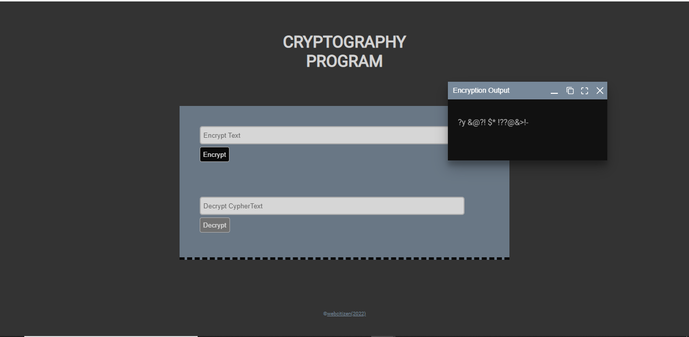

# Encryptor
A JavaScript program that encrypts and decrypts character symbols_simple security measure
HTML, CSS and Some Javascript Codes are in the index.html file

link: https://immanuel404.github.io/Encryptor/

